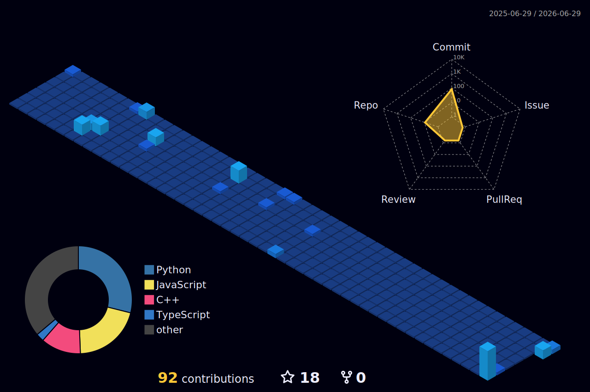

<h1 align="center">Aditya Ojha</h1>
<h3 align="center"></h3>

  

- 👷 <samp>Fresh Grad with B.Tech in Electrical Engineering (2022-2026) from National Institute of Technology Raipur</samp>
- 🔭 <samp>Former Problem Setter & MTS Intern at GeeksforGeeks</samp>
- 💬 <samp>Lets talk about CP / MERN Stack / React Native / Advanced Algorithms</samp>
- 🌱 <samp>Incoming Software Engineer II at HCLSoftware</samp>
- ⚡ <samp>Big anime fan </samp>

<h3><b><samp>Connect with Me</samp></b></h3>

  &nbsp;
  

<h3><b><samp>Competitive Programming</samp></b></h3>

  &nbsp;
  &nbsp;
  

<h3><b><samp>Skills and Languages</samp></b></h3>

  &nbsp;
  &nbsp;
  &nbsp;
  &nbsp;
  &nbsp;
  &nbsp;
  &nbsp;
  

<h3><b><samp>Tools and Platform</samp></b></h3>

  &nbsp;
  

  

## Contribution Heat Map

  

### <samp>Github Stats</samp>

